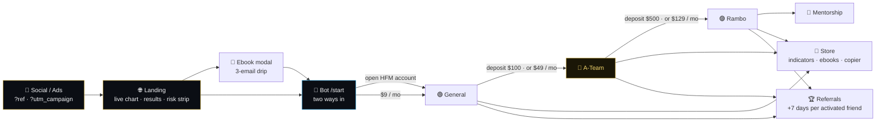
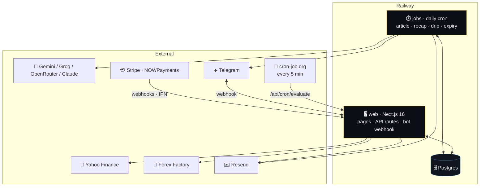
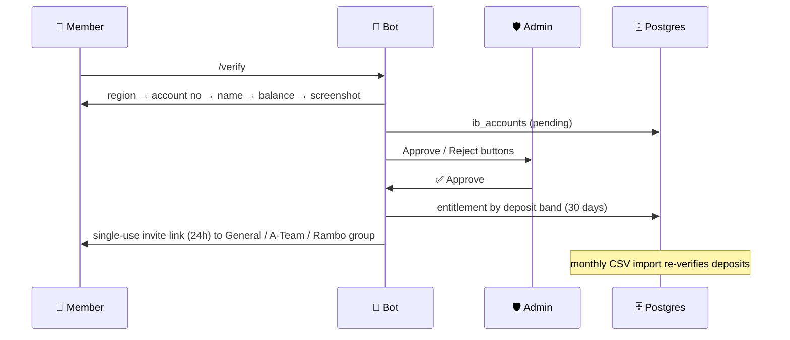
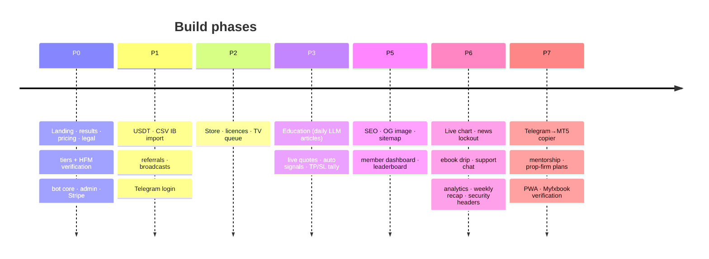

<a id="top"></a>

<div align="center">

<a href="https://websitesam-production.up.railway.app"></a>

<br/>

<a href="https://websitesam-production.up.railway.app"></a>

**🔗 https://websitesam-production.up.railway.app** · 🤖 Telegram bot: [@samproducts_bot](https://t.me/samproducts_bot)


<br/>

[](#-deploy-on-railway)
[](#-tech-stack)
[](#-tech-stack)
[](#-tech-stack)
[](#-telegram-bot)

[](#-tech-stack)
[](LICENSE)
[](#-roadmap)

<br/>

**[✨ Overview](#-overview) · [🪜 Tiers](#-tier-ladder) · [🔁 Funnel](#-funnel) · [🧬 Architecture](#-architecture) · [📡 Live engine](#-live-signal-engine) · [🤖 Bot](#-telegram-bot) · [🖥️ Pages](#️-pages) · [🧱 Stack](#-tech-stack) · [🚀 Deploy](#-deploy-on-railway) · [🗺️ Roadmap](#️-roadmap)**

<br/>

<sub>⚠️ Everything here is for <b>education only</b>. Trading gold and CFDs on margin carries a high risk of loss. See <a href="docs/compliance-copy.md">compliance copy</a>.</sub>

</div>

<br/>

## ✨ Overview

> **SAMBANGGOLD** — the complete monetization system behind Sam's XAUUSD signal & education channel. Brand kit (Anton wordmark, SBG monogram, the hammering-robot mascot) lives in `public/brand/`; strings in `src/config/brand.ts`.

<div align="center">&nbsp;&nbsp;</div>

<table>
<tr>
<td width="50%" valign="top">

### 🎯 What it does

- 🥇 **XAUUSD signals** with entry / SL / TP, tallied automatically against live candles
- 🚪 **Two doors, one ladder** — open an HFM account under our IB *or* pay monthly on any broker
- 🛒 **Store** — TradingView + MT5 indicators, ebooks, copier, mentorship
- 📈 **Public track record** — win rate, R, expectancy, drawdown, losses included
- 🎓 **Education** — one bilingual article every day from a free LLM, plus a markdown CMS for your own posts
- 🧲 **Capture & convert** — ebook modal → 3-email drip · support chat · campaign analytics

</td>
<td width="50%" valign="top">

### ⚡ At a glance

| | |
|---|---|
| 🌐 Site | Next.js 16 · Tailwind 4 · next-intl |
| 🗄️ Data | Railway Postgres · Drizzle |
| 💳 Pay | Stripe · NOWPayments (USDT) |
| 🤖 Bot | grammY webhook · 12 commands |
| 🎨 Brand | Anton wordmark · SBG monogram · animated mascot |
| 📡 Feeds | Yahoo Finance · Forex Factory |
| 🧠 LLM | Gemini · Groq · OpenRouter · Claude |
| 🔐 Auth | Magic link · Google · Telegram |
| ☁️ Host | Railway `web` + `jobs` cron |
| 🔗 Live | [websitesam-production.up.railway.app](https://websitesam-production.up.railway.app) |

</td>
</tr>
</table>

<p align="right"><a href="#top">⬆ back to top</a></p>

## 🪜 Tier ladder

<div align="center">

| Tier | 🏦 Door A · HFM IB | 💳 Door B · own broker | Includes |
|:--:|:--|:--|:--|
| 🌐 **Public** | — | — | 1 delayed XAUUSD signal / day · daily bias · weekly recap |
| 🟢 **General** `free` | account, **no deposit** | **$9 / mo** | Ebook · full daily bias · results · community · 2 full signals / week |
| 🔵 **A-Team** ⭐ `pro` | **≥ $100** deposit | **$49 / mo** | All XAUUSD signals live · A-Team group · monthly report · TV indicator |
| 🟣 **Rambo** `elite` | **≥ $500** deposit | **$129 / mo** | A-Team + all instruments · full TV/MT5 suite · copier · live sessions |
| 👑 **Mentorship** | — | $499 / $199 mo | Rambo + course + 1:1 *(phase 7)* |

</div>

> 💡 Entitlement is always the **higher** of your IB tier and your paid tier. Annual = 2 months free. First **50** A-Team places are founding seats (`BRAND.foundingMemberCap`). Ebooks carry a tier (`free` snippet / `standard` $19, in General / `premium` $49, in A-Team) set in `/admin/products`. Display names live in `TIER_LABELS` (`src/config/tiers.ts`) and `messages/*.json`; the internal keys `free / pro / elite` never change.

<p align="right"><a href="#top">⬆ back to top</a></p>

## 🔁 Funnel



<p align="right"><a href="#top">⬆ back to top</a></p>

## 🧬 Architecture



<details>
<summary><b>🔐 HFM verification flow</b> (click to expand)</summary>



</details>

<p align="right"><a href="#top">⬆ back to top</a></p>

## 📡 Live signal engine

<table>
<tr>
<td width="33%" valign="top">

**🕯️ Live data**
- Ticker + hero card from Yahoo Finance (60s cache)
- Gold chart with **1H / 4H / 1D** tabs and entry / SL / TP lines
- Hidden automatically when feeds are down

</td>
<td width="33%" valign="top">

**⚙️ Auto setups**
- One running XAUUSD setup at a time: scalping · intraday · swing
- Paused ±30 min around 🔴 USD news
- Every 5 min the tally moves status → TP1 / TP2 / TP3 / SL / BE

</td>
<td width="33%" valign="top">

**📊 Proof**
- Results page recomputes win rate, avg R, expectancy, max DD
- Monday recap posted to the public channel
- Member dashboard: personal stats from signals you mark as taken

</td>
</tr>
</table>

<p align="right"><a href="#top">⬆ back to top</a></p>

## 🤖 Telegram bot

<details open>
<summary><b>💬 Commands</b></summary>

<br/>

| Command | Does |
|---|---|
| `/start [ref]` | Onboards, tags the campaign, links `link_<userId>` / `ref_CODE`, sends "two ways in" |
| `/verify` | Region → account no → name → balance → screenshot → admin Approve/Reject → single-use invite link |
| `/status` · `/upgrade` · `/plans` | Current tier, next step (deposit more or pay), tier list |
| `/products` · `/ebook` | Store, lead magnet |
| `/news` | This week's high-impact USD events (Forex Factory) in MYT |
| `/mystats` · `/leaderboard` | Personal signal stats, referral leaderboard + your link |
| `/language ms\|en` | Reply language (else linked account locale, else Telegram client language) |
| `/support` · `/help` | Human handoff, command list |

</details>

<details>
<summary><b>⚙️ Automation</b></summary>

<br/>

- 🚪 Join-request gatekeeping by entitlement, single-use invite links (24h)
- 📣 Signal fan-out: teaser to public, full text to General / A-Team / Rambo, TP/SL updates replied in place
- 🧭 Auto XAUUSD setups from live data, paused ±30 min around red USD news
- ⏱️ Every 5 min: running signals tallied against Yahoo candles
- 📈 Weekly recap (Mondays) → public channel, LLM-written when a key is set, factual template otherwise
- ⏳ Expiry job → soft kick → win-back message · segmented broadcasts · 3-step lead drip

</details>

<p align="right"><a href="#top">⬆ back to top</a></p>

## 🖥️ Pages

| Route | What you get |
|---|---|
| 🏠 `/` | Hero field, live signal card, gold chart, news calendar, two doors, tier cards, FAQ (JSON-LD), ebook modal |
| 📈 `/results` | Win rate, avg R, expectancy, max DD, equity curve, monthly table, chart + news, last week's recap, Myfxbook slot |
| 💳 `/pricing` | Door toggle (HFM / own broker), monthly / annual, feature matrix, door comparison |
| 🎓 `/education` | One bilingual article per day (40-topic bank) plus your own posts · search · category filters · sticky table of contents · reading progress · interactive checklists · share · related & prev/next |
| 🛒 `/products` | Indicators, ebooks, copier · sticky buy bar on product pages |
| 🧑‍💻 `/dashboard` | Personal stats, equity curve, referral leaderboard, share links |
| 👤 `/account` | Plan, Telegram link / unlink, HFM verification, TradingView, downloads, licences, referral |
| 🛡️ `/admin` | Signals, IB approvals + CSV import, broadcasts, TV queue, products, article CMS (write / edit / delete, AI fills the other language), users, leads, analytics, recap |

<details>
<summary><b>🔎 SEO & growth built in</b></summary>

<br/>

- Per-page titles / descriptions (ms/en), canonical + `hreflang`, generated Open Graph image, JSON-LD (Organization, WebSite, FAQ, Article, Product), `robots.txt`, `sitemap.xml`
- `?ref=CODE` referrals (+7 days per activated friend), first-touch `camp` attribution (`?ref` / `utm_campaign` / `utm_source` / `?c`), first-party page-view beacon, `/admin/analytics` funnel per campaign
- Security headers: CSP, HSTS, `X-Frame-Options`, Referrer-Policy, Permissions-Policy

</details>

<p align="right"><a href="#top">⬆ back to top</a></p>

## 🧱 Tech stack

<div align="center">


</div>

| Layer | Choice |
|---|---|
| App | Next.js 16 (App Router) · TypeScript · Tailwind 4 · next-intl |
| Data | Railway Postgres · Drizzle ORM · migrations run on boot |
| Auth | Auth.js v5 · magic link via Resend · Google (optional) · Telegram Login Widget |
| Payments | Stripe (cards) · NOWPayments (USDT, HMAC IPN) |
| Messaging | grammY Telegram bot (webhook, secret token) |
| Charts | TradingView lightweight-charts (live candles + equity curves) |
| Data feeds | Yahoo Finance chart API · Forex Factory weekly calendar |
| Content | Gemini (default, auto model discovery) · Groq · OpenRouter · Anthropic |
| Email | Resend (magic links, lead drip) |
| Security | CSP, HSTS, frame / referrer / permissions headers · hash-verified Telegram login |
| Hosting | Railway `web` + `jobs` cron · cron-job.org → `/api/cron/evaluate` |
| Languages | 🇲🇾 Bahasa Melayu (default) · 🇬🇧 English |

<p align="right"><a href="#top">⬆ back to top</a></p>

## 🚀 Deploy on Railway

<details open>
<summary><b>1 · Project & database</b></summary>

<br/>

1. **New Project → Deploy from GitHub** → this repo, branch `main`.
2. `+ New → Database → PostgreSQL`.
3. Web service → **Variables** → `DATABASE_URL = ${{Postgres.DATABASE_URL}}` plus everything in [`.env.example`](.env.example). Generate a domain; set `AUTH_URL` and `NEXT_PUBLIC_SITE_URL` to it.
4. `npm start` runs migrations and the idempotent seed on every boot. `SEED_ADMIN_EMAIL` makes that user admin → `/admin`.

</details>

<details>
<summary><b>2 · Telegram</b></summary>

<br/>

```bash
curl "https://api.telegram.org/bot$TOKEN/setWebhook" \
  -d url="https://<domain>/api/telegram/webhook" \
  -d secret_token="$TELEGRAM_WEBHOOK_SECRET" \
  -d allowed_updates='["message","callback_query","chat_join_request"]'
```

- `@BotFather` → `/setdomain` → your domain (enables the Login Widget)
- Add the bot as admin to the public channel and each private group; ids start with `-100`
- Optional: `NEXT_PUBLIC_TG_SUPPORT=https://t.me/<handle>` powers the "Chat with Sam" button

</details>

<details>
<summary><b>3 · Payments</b></summary>

<br/>

- **Stripe** → products General / A-Team / Rambo (env keys stay `STRIPE_PRICE_FREE_*` / `_PRO_*` / `_ELITE_*`) (monthly + yearly) → paste `price_…` ids → webhook `https://<domain>/api/stripe/webhook` with `checkout.session.completed`, `customer.subscription.*`
- **NOWPayments** → `NOWPAYMENTS_API_KEY`, `NOWPAYMENTS_IPN_SECRET`, IPN URL `https://<domain>/api/crypto/ipn`

</details>

<details>
<summary><b>4 · Live engine & automation</b></summary>

<br/>

| Piece | Setup |
|---|---|
| ⏱️ Signal tally + auto setups + daily article safety net | Set `CRON_SECRET`; on [cron-job.org](https://cron-job.org) call `https://<domain>/api/cron/evaluate?key=<CRON_SECRET>` every 5 minutes. The same call generates the daily article when the jobs service missed it (needs the LLM key on the web service too) |
| ✍️ Article on demand | `https://<domain>/api/cron/article?key=<CRON_SECRET>` generates one now (add `&wait=1` to wait for the result). On the jobs service, set `ARTICLE_FORCE=1` to bypass the 20h guard for one run, then remove it |
| 🗓️ Daily article · Monday recap · drip · expiry | Second Railway service from the same repo: start `npm run jobs`, cron `0 3 * * *`, **same variables** (paste the literal `DATABASE_URL` if the reference shows empty; the log prints the env names it sees) |
| 🧠 LLM | Add any of `GEMINI_API_KEY`, `GROQ_API_KEY`, `NVIDIA_API_KEY`, `OPENROUTER_API_KEY`, `OLLAMA_API_KEY`, `LLM_BASE_URL`+`LLM_API_KEY`, `ANTHROPIC_API_KEY`. All keys are used in this order: ollama, gemini, openrouter, nvidia, groq, custom, anthropic. `LLM_PROVIDER` moves one to the front; the rest are failover. Models are discovered per key; `/admin/articles` lists them and shows which one each provider will use. Pin per provider with `LLM_MODEL_NVIDIA`, `LLM_MODEL_OLLAMA`, `LLM_MODEL_OPENROUTER`, `LLM_MODEL_GEMINI` (exact id, or words such as `nemotron 3.5 lightning` matched against the live list). Test one with `/api/cron/article?key=…&provider=nvidia&model=meta/llama-3.3-70b-instruct`; list what a key can see with `…&provider=nvidia&models=1` |
| ✉️ Leads | `RESEND_API_KEY` + `AUTH_EMAIL_FROM` on a verified domain → welcome + day-2 + day-5 emails |
| 🔐 Google sign-in | OAuth client (Web) → redirect URI `https://<domain>/api/auth/callback/google` → `GOOGLE_CLIENT_ID` + `GOOGLE_CLIENT_SECRET` |

</details>

<details>
<summary><b>💻 Local dev</b></summary>

<br/>

```bash
cp .env.example .env.local        # fill DATABASE_URL etc.
npm i
npm run db:migrate && SEED_ADMIN_EMAIL=you@example.com npm run db:seed
npm run dev                        # http://localhost:3000
npm run lint && npm run typecheck && npm run build
```

</details>

<p align="right"><a href="#top">⬆ back to top</a></p>

## 📚 Docs

| 📄 | |
|---|---|
| [Product & monetization spec](docs/product-spec.md) | Tiers, store, analysis products, funnels, data model, pages |
| [Bot spec](docs/bot-spec.md) | Commands, gatekeeping, fan-out, security |
| [HFM verification runbook](docs/hfm-verification-runbook.md) | IB account matching, deposit bands, re-verification |
| [Compliance copy](docs/compliance-copy.md) | Risk warning, education disclaimer, IB disclosure |
| [Build log](docs/build-log.md) | Decisions and history |

<p align="right"><a href="#top">⬆ back to top</a></p>

## 🗺️ Roadmap



- [x] **P0 – P6** shipped, live on Railway
- [ ] **P7** Telegram→MT5 copier · mentorship tier · prop-firm plans · PWA · Myfxbook verification

<br/>

<div align="center">


<a href="https://websitesam-production.up.railway.app"><b>🌐 websitesam-production.up.railway.app</b></a> · <a href="https://t.me/samproducts_bot">🤖 @samproducts_bot</a>

<sub>Made with ☕ and gold candles · Bahasa Melayu 🇲🇾 first · <b>Not financial advice.</b></sub>

</div>
