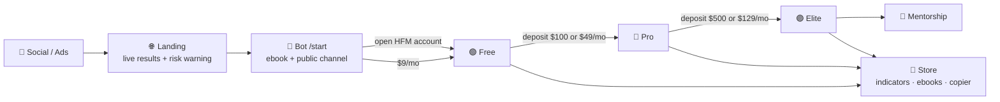

# 🥇 Sam Trading Platform

**The website, membership engine and Telegram bot behind Sam's XAUUSD signal & education channel.**

⚠️ Everything here is for **education only**. Trading gold and CFDs on margin carries a high risk of loss. See <a href="docs/compliance-copy.md">compliance copy</a>.

 

## ✨ What this is

A monetization system for a gold-trading channel, built to be brand-swappable (the name "Sam" is a placeholder).

| 🎯 Goal | 💡 How |
|---|---|
| Turn free followers into members | Public channel teaser → bot → two ways in on every tier |
| Two doors, one ladder | **Open an HFM account under our IB** *or* **pay monthly** on your own broker |
| Sell more than signals | TradingView + MT5 indicators, ebooks, copier, mentorship |
| Prove it | Public results page with win rate, RR, drawdown and third-party verification |

 

## 🪜 Tier ladder

| Tier | 🏦 Door A · HFM IB | 💳 Door B · own broker | Includes |
|:--|:--|:--|:--|
| 🌐 **Public** | — | — | 1 delayed XAUUSD signal/day, daily bias, weekly recap |
| 🟢 **Free** | account, **no deposit** | **$9/mo** | Ebook, full daily bias, results, community, 2 full signals/week |
| 🔵 **Pro** | **≥ $100** deposit | **$49/mo** | All XAUUSD signals live, Pro group, monthly report, basic TV indicator |
| 🟣 **Elite** | **≥ $500** deposit | **$129/mo** | Pro + all instruments, full TV/MT5 suite, copier, live sessions |
| 👑 **Mentorship** | — | $499 / $199 mo | Elite + course + 1:1 *(phase 3)* |

> Entitlement is always the **higher** of your IB tier and your paid tier. Annual = 2 months free.

 

## 🔁 Funnel

 

## 🤖 Telegram bot

<b>Commands</b> (click to expand)

| Command | Does |
|---|---|
| `/start [ref]` | Onboards, tags the campaign, sends ebook + "two ways in" |
| `/verify` | Takes an HFM account number → pending → approved → single-use invite link |
| `/subscribe` | Stripe or USDT checkout per tier |
| `/status` · `/upgrade` | Current tier, expiry, next step |
| `/products` · `/ebook` · `/support` | Store, lead magnet, human handoff |

<b>Automation</b>

- Join-request gatekeeping by entitlement, single-use invite links (24h)
- Signal fan-out: post once → teaser to public, full text to Pro/Elite, edits in place
- Expiry job → soft kick → win-back coupon
- Segmented broadcasts (tier, language, campaign)

 

## 🧱 Tech stack

| Layer | Choice |
|---|---|
| App | Lovable project `sam-trading` · TanStack Start · Tailwind · shadcn/ui |
| Data & auth | Supabase (Postgres, RLS, storage, scheduled functions) |
| Payments | Stripe (cards) · NOWPayments (USDT) |
| Messaging | Telegram Bot API · Resend email |
| Charts | TradingView lightweight-charts |
| Languages | English 🇬🇧 · Malay 🇲🇾 |

 

## 📚 Docs

| 📄 | |
|---|---|
| [Product & monetization spec](docs/product-spec.md) | Tiers, store, analysis products, funnels, data model, pages |
| [Bot spec](docs/bot-spec.md) | Commands, gatekeeping, fan-out, security |
| [HFM verification runbook](docs/hfm-verification-runbook.md) | IB account matching, deposit bands, re-verification |
| [Compliance copy](docs/compliance-copy.md) | Risk warning, education disclaimer, IB disclosure |
| [Lovable build log](docs/lovable-prompts.md) | Prompts used, for reproducibility |

 

## 🗺️ Roadmap

- [x] Market & repo research, product design
- [ ] **P0** Landing, results, pricing, legal · tiers & HFM verification · bot core · Stripe
- [ ] **P1** USDT payments · expiry & kick · CSV IB import · referrals · email drips
- [ ] **P2** Store (TV/MT5 licences, ebooks) · copier · TV access queue
- [ ] **P3** Multi-instrument · mentorship · prop-firm plans · PWA

 

Made with ☕ and gold candles. Not financial advice.

