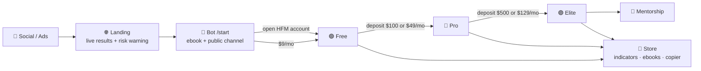

<div align="center">

# 🥇 Sam Trading Platform

**The website, membership engine and Telegram bot behind Sam's XAUUSD signal & education channel.**

[](#-roadmap)
[](https://lovable.dev)
[](#-tech-stack)
[](LICENSE)

<sub>⚠️ Everything here is for **education only**. Trading gold and CFDs on margin carries a high risk of loss. See <a href="docs/compliance-copy.md">compliance copy</a>.</sub>

</div>

<br/>

## ✨ What this is

A monetization system for a gold-trading channel, built to be brand-swappable (the name "Sam" is a placeholder).

| 🎯 Goal | 💡 How |
|---|---|
| Turn free followers into members | Public channel teaser → bot → two ways in on every tier |
| Two doors, one ladder | **Open an HFM account under our IB** *or* **pay monthly** on your own broker |
| Sell more than signals | TradingView + MT5 indicators, ebooks, copier, mentorship |
| Prove it | Public results page with win rate, RR, drawdown and third-party verification |

<br/>

## 🪜 Tier ladder

| Tier | 🏦 Door A · HFM IB | 💳 Door B · own broker | Includes |
|:--|:--|:--|:--|
| 🌐 **Public** | — | — | 1 delayed XAUUSD signal/day, daily bias, weekly recap |
| 🟢 **Free** | account, **no deposit** | **$9/mo** | Ebook, full daily bias, results, community, 2 full signals/week |
| 🔵 **Pro** | **≥ $100** deposit | **$49/mo** | All XAUUSD signals live, Pro group, monthly report, basic TV indicator |
| 🟣 **Elite** | **≥ $500** deposit | **$129/mo** | Pro + all instruments, full TV/MT5 suite, copier, live sessions |
| 👑 **Mentorship** | — | $499 / $199 mo | Elite + course + 1:1 *(phase 3)* |

> Entitlement is always the **higher** of your IB tier and your paid tier. Annual = 2 months free.

<br/>

## 🔁 Funnel



<br/>

## 🤖 Telegram bot

<details>
<summary><b>Commands</b> (click to expand)</summary>

| Command | Does |
|---|---|
| `/start [ref]` | Onboards, tags the campaign, sends ebook + "two ways in" |
| `/verify` | Takes an HFM account number → pending → approved → single-use invite link |
| `/subscribe` | Stripe or USDT checkout per tier |
| `/status` · `/upgrade` | Current tier, expiry, next step |
| `/products` · `/ebook` · `/support` | Store, lead magnet, human handoff |

</details>

<details>
<summary><b>Automation</b></summary>

- Join-request gatekeeping by entitlement, single-use invite links (24h)
- Signal fan-out: post once → teaser to public, full text to Pro/Elite, edits in place
- Expiry job → soft kick → win-back coupon
- Segmented broadcasts (tier, language, campaign)

</details>

<br/>

## 🧱 Tech stack

| Layer | Choice |
|---|---|
| App | Next.js 16 (App Router) · TypeScript · Tailwind 4 |
| Data | Railway Postgres · Drizzle ORM |
| Auth | Auth.js v5 · magic link via Resend · Telegram link |
| Payments | Stripe (cards) · NOWPayments (USDT, P1) |
| Messaging | grammY Telegram bot (webhook) |
| Charts | TradingView lightweight-charts |
| Hosting | Railway (`web` service + `jobs` cron) |
| Languages | Bahasa Melayu 🇲🇾 (default) · English 🇬🇧 |

<br/>

## 🚀 Deploy on Railway

<details open>
<summary><b>1 · Create the project</b></summary>

1. Railway → **New Project → Deploy from GitHub repo** → pick this repo, branch `main`.
2. **Add Postgres**: `+ New → Database → PostgreSQL`. Railway injects `DATABASE_URL` into services in the same project (use the *Variable reference* `${{Postgres.DATABASE_URL}}` on the web service).
3. The `web` service builds with Railpack automatically. `railway.json` sets the pre-deploy command `npm run db:migrate`, start `npm run start`, health check `/api/health`.

</details>

<details>
<summary><b>2 · Environment variables (web service)</b></summary>

Copy from [`.env.example`](.env.example). Minimum to boot:

```
DATABASE_URL=${{Postgres.DATABASE_URL}}
AUTH_SECRET=<openssl rand -base64 32>
AUTH_URL=https://<your-domain>
NEXT_PUBLIC_SITE_URL=https://<your-domain>
RESEND_API_KEY=re_...
AUTH_EMAIL_FROM=Sam <noreply@yourdomain.com>
TELEGRAM_BOT_TOKEN=123456:ABC...
TELEGRAM_BOT_ID=123456
NEXT_PUBLIC_TG_BOT_USERNAME=YourBot
TELEGRAM_WEBHOOK_SECRET=<random string>
TELEGRAM_ADMIN_CHAT_ID=<your Telegram user id or admin group id>
TELEGRAM_PUBLIC_CHANNEL_ID=-100...
TELEGRAM_FREE_GROUP_ID=-100...
TELEGRAM_PRO_GROUP_ID=-100...
TELEGRAM_ELITE_GROUP_ID=-100...
STRIPE_SECRET_KEY=sk_live_...
STRIPE_WEBHOOK_SECRET=whsec_...
STRIPE_PRICE_FREE_MONTH=price_... (and _YEAR, PRO_, ELITE_)
```

</details>

<details>
<summary><b>3 · Seed + first admin</b></summary>

Run once from the Railway service shell (or locally with the Railway `DATABASE_URL`):

```bash
SEED_ADMIN_EMAIL=you@example.com npm run db:seed
```

Sign in at `/signin` with that email → you get the `admin` role → `/admin`.

</details>

<details>
<summary><b>4 · Telegram bot</b></summary>

1. @BotFather → `/newbot` → copy token. `/setprivacy` → **Disable** (so the bot can read group join requests).
2. Add the bot as **admin** to the public channel and each private group (Free / Pro / Elite) with *Invite users via link* + *Ban users* rights.
3. Get chat ids: add @RawDataBot to each chat, or forward a message to @userinfobot. Channel/group ids start with `-100`.
4. Point the webhook at Railway (replace values):

```bash
curl "https://api.telegram.org/bot$TOKEN/setWebhook" \
  -d url="https://<your-domain>/api/telegram/webhook" \
  -d secret_token="$TELEGRAM_WEBHOOK_SECRET" \
  -d allowed_updates='["message","callback_query","chat_join_request"]'
```

5. Send `/start` to the bot. Approve/reject buttons arrive in `TELEGRAM_ADMIN_CHAT_ID`.

</details>

<details>
<summary><b>5 · Stripe</b></summary>

1. Products → create **Free / Pro / Elite** with monthly + yearly prices (USD 9/90, 49/490, 129/1290). Paste the `price_...` ids into env.
2. Developers → Webhooks → endpoint `https://<your-domain>/api/stripe/webhook`, events: `checkout.session.completed`, `customer.subscription.created`, `customer.subscription.updated`, `customer.subscription.deleted`. Copy the signing secret to `STRIPE_WEBHOOK_SECRET`.

</details>

<details>
<summary><b>6 · Cron jobs service</b></summary>

`+ New → GitHub repo` (same repo) → name `jobs` → Settings: **Start command** `npm run jobs`, **Cron schedule** `0 3 * * *`. Same env vars as `web` (reference them). It expires stale entitlements after a 7-day grace and soft-kicks from groups.

</details>

<details>
<summary><b>Local dev</b></summary>

```bash
cp .env.example .env.local   # fill DATABASE_URL etc.
npm i
npm run db:migrate && SEED_ADMIN_EMAIL=you@example.com npm run db:seed
npm run dev
```

</details>

<br/>

## 📚 Docs

| 📄 | |
|---|---|
| [Product & monetization spec](docs/product-spec.md) | Tiers, store, analysis products, funnels, data model, pages |
| [Bot spec](docs/bot-spec.md) | Commands, gatekeeping, fan-out, security |
| [HFM verification runbook](docs/hfm-verification-runbook.md) | IB account matching, deposit bands, re-verification |
| [Compliance copy](docs/compliance-copy.md) | Risk warning, education disclaimer, IB disclosure |
| [Build log](docs/build-log.md) | Decisions and history |

<br/>

## 🚀 Deploy on Railway

1. **New Project → Deploy from GitHub** → this repo, branch `main`. Add **PostgreSQL**.
2. On the web service → **Variables**: `DATABASE_URL=${{Postgres.DATABASE_URL}}` plus everything in [`.env.example`](.env.example). Generate a domain, set `AUTH_URL` and `NEXT_PUBLIC_SITE_URL` to it.
3. `npm start` runs migrations and the idempotent seed on every boot. Set `SEED_ADMIN_EMAIL` to your email and that user becomes admin (`/admin`). Sample signals/products are inserted only when the tables are empty.
5. Telegram: `curl "https://api.telegram.org/bot<TOKEN>/setWebhook" -d url="https://<domain>/api/telegram/webhook" -d secret_token="<TELEGRAM_WEBHOOK_SECRET>"`.
6. Stripe: webhook `https://<domain>/api/stripe/webhook` with `checkout.session.completed`, `customer.subscription.*`.
7. Optional cron service (same repo): start command `npm run jobs`, schedule `0 3 * * *`.

<br/>

## 🗺️ Roadmap

- [x] Market & repo research, product design
- [x] **P0** Landing, results, pricing, legal · tiers & HFM verification · bot core · admin · Stripe
- [ ] **P1** USDT payments · CSV IB import · referrals · email drips · broadcasts · Telegram login
- [ ] **P2** Store (TV/MT5 licences, ebooks) · copier · TV access queue
- [ ] **P3** Multi-instrument · mentorship · prop-firm plans · PWA

<br/>

<div align="center">
<sub>Made with ☕ and gold candles. Not financial advice.</sub>
</div>
